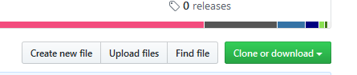

# Station météo connectée

Une station météo qui fait remonter la température et la pression atmosphérique sur Internet, avec valeurs consultables sur un smartphone.

## Schéma de câblage (BMP180)

## Paramétrer la station météo

Rendez vous sur cette adresse pour avoir toutes les étapes : https://github.com/fablab02/station_meteo/blob/master/Station_meteo_tutoriel.pdf (cliquez sur download pour avoir le PDF avec les liens fonctionnels)

## Tutoriel station météo

1. Téléchargez et installez le logiciel Arduino (pour envoyer le code sur la carte) : https://www.arduino.cc/en/main/software
2. Téléchargez le code de la station ici : https://github.com/fablab02/station_meteo via le bouton "Clone or download" vous obtiendrez un fichier ZIP avec tous le projet.
    
3. Décompressez le dossier sur votre bureau. Copiez le contenu du dossier "librairies" dans le dossier Documents\Arduino\libraries
4. Copiez le dossier "station_meteo" dans le dossier Documents\Arduino
   Voila ce que vous devriez avoir dans Documents\Arduino : 

### Application Blynk

[Blynk](https://blynk.io/en/getting-started) est une application sur smartphone que nous utilisons pour la station météo. Elle est gratuite (jusqu'à un certain point) et très simple d'utilisation.

1. Installez l'app Blynk sur votre smartphone.
2. Créez un compte.
3. Créer un nouveau projet (le + en haut à droite)
4. Donnez un nom au projet.
   1. Choose device : ESP8266
   2. Connexion type : Wi-Fi
   3. Thème : ce que vous voulez.
5. Un mail avec votre code d'authentification vous est envoyé. Nous allons l'utiliser un peu plus loin.

### Sur le logiciel Arduino

1. Allez dans fichier > préférences

2. Collez cette adresse dans le champ "URL de gestionnaire de cartes supplémentaires" puis "OK" :

   > https://arduino.esp8266.com/stable/package_esp8266com_index.json

   

3. Fichier > ouvrir et ouvrez le fichier du code de la station en .ino (attention, le fichier .ino doit être dans un dossier avec un nom identique au fichier)

4. Une nouvelle fenêtre apparait, c'est le code de la station météo. Il y a quelques modifications à faire...

   1. Tout se passe ici, en début de code. Les éléments à changer sont entre guillemets. (ne supprimez pas ces derniers !)
      
   2. Le code d'authentification Blynk est à récupérer sur le mail que vous recevrez une fois votre inscription sur Blynk effectuée.
   3. A la place de "nom du réseau wifi" remplacez par le nom de votre réseau wifi.
   4. A la place de "code du wifi" mettez le mot de passe de votre réseau wifi

5. On y est presque ! Allez dans Outils>type de carte>gestionnaire de cartes. La liste des cartes se charge sur Internet...

6. Cherchez "nodeMCU" puis installez "ESP8266 by ESP8266 Community".
   

7. Branchez la station météo sur le PC, puis allez dans Outils. Ici on quelques réglages à faire.

   1. Dans "type de carte", sélectionnez en bas de la liste "Generic ESP8266 module"

   2.  Allez dans "port "COM"" et sélectionnez le port COM sur lequel est branché la station météo (en général c'est le chiffre le plus élevé)

      

8. Normalement, tout est prêt ! Il n'y a plus qu'à envoyer le code sur la station météo, pour ça allez dans Croquis > Téléverser avec un programmateur. En bas du logiciel vous allez voir un chargement se faire. 
   

   Il faut attendre qu'il se termine (ça peut prendre plusieurs minutes) Si il y a une erreur, c'est soit une faut de frappe dans la partie du code modifiée, soit le mauvais port COM qui est sélectionné.

### On retourne sur Blynk

Dans votre projet, le petit + vous permet d'ajouter des modules. Vous avez un certains nombre de "points" (Energy balance) dans la version gratuite, et les modules vous coutent un certain nombre de points. Nous avons besoin d'afficher deux valeurs (température et humidité). Pour cela nous allons utiliser le module "Labeled value".

Une boite viens d'apparaitre sur l'interface. Tapotez dessus et vous voila dans ses réglages.

Tapotez sur "PIN" et sélectionnez "Virtual" et à droite :

* V2 pour la température
* V3 pour la pression

Voila, votre visualisation est prête !  Tapotez sur l'icone "lecture" et haut à droite pour lancer le programme et lire les valeurs. (il faut bien sur que la station météo soit alimentée et connectée au wifi).